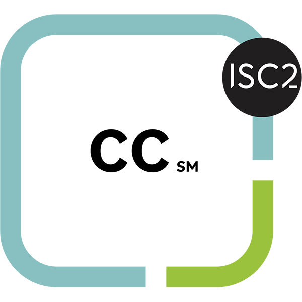
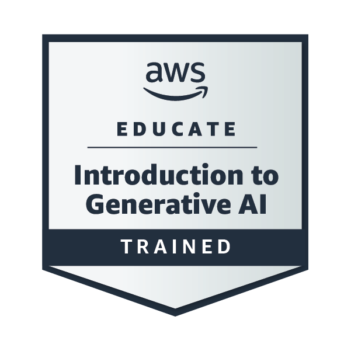
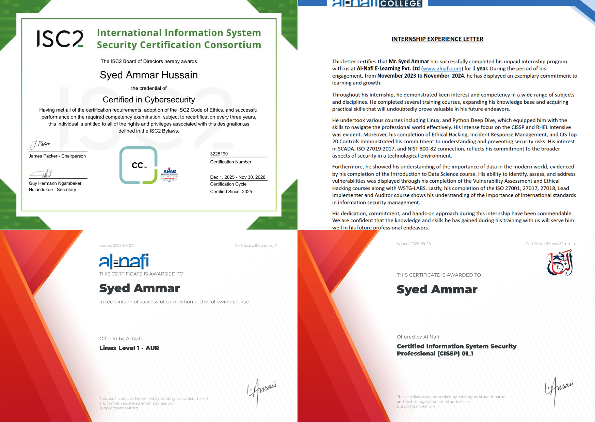

Who am I?

Hi, I’m Syed — the kind of person who can’t use technology without trying to understand what’s happening underneath it.
Linux is where that curiosity turned into a **full-on obsession**, and it’s what pushed me deeper into systems, security, and how the whole stack works behind the scenes.

I enjoy exploring the connections between **Linux internals**, **security practices**, and **cloud technologies** — not just the tools themselves, but the principles and reasoning behind them. Whether it’s system behavior, configuration logic, or frameworks like **ISO 27001**, NIST SP 800-53, and CIS benchmarks, I love digging into the why.

My learning style is simple:
experiment → break → investigate → fix → pretend Microsoft caused the problem __(kidding… mostly)__.
That cycle has shaped how I approach troubleshooting and how I build: calm, methodical, and grounded in technical depth.

At the core, I’m someone who values strong fundamentals and continuous improvement. I like making systems cleaner, more secure, and more predictable — and leaving things better than I found them, whether that’s infrastructure, documentation, or a messy config someone swore would “never break.”

<<<<<<< HEAD
If you’re interested in my work or want to reach out, check the [Contact](#Contact) section below.

## Badge Collection

  
  
  

## Cert Collection

  
=======
If you’re interested in my work or want to reach out, take a look at the bottom of this page.

Badge Collection

Cert Collection

>>>>>>> 4dce041 (Added CCP badge & cert)

<<<<<<< HEAD
## Projects
=======
Projects
>>>>>>> 4dce041 (Added CCP badge & cert)

User Management Script – Automated Linux user provisioning, deletion, and permission management with audit-friendly logs.

Repo →

Building Linux From Scratch – A hands-on exploration of constructing a Linux system from the ground up.

Article →

FS Audit Data Pipeline – Designed a scalable pipeline for filesystem audit logs to strengthen security compliance.

Repo →

<<<<<<< HEAD
## Contact

  
  &nbsp;&nbsp;
  
  &nbsp;&nbsp;
  
  &nbsp;&nbsp;
  
=======
Contact

&nbsp;&nbsp;

&nbsp;&nbsp;

&nbsp;&nbsp;

>>>>>>> 4dce041 (Added CCP badge & cert)

